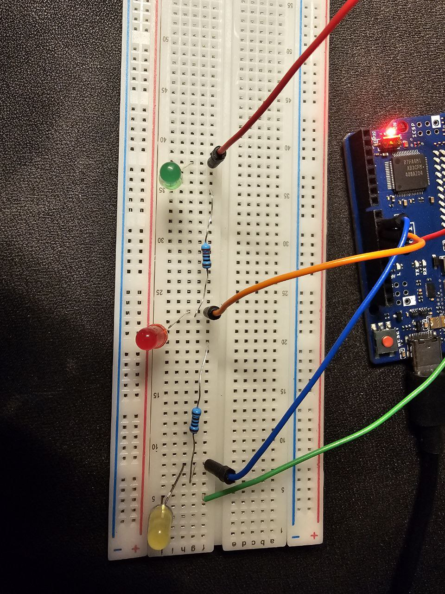

### Blinking LED

In order to make this project to work, please make sure the electrical components are put like:



To burn the code into the board, please run:

```
cd ../
arduino-cli compile --upload -b arduino:renesas_uno:unor4wifi -p /dev/ttyACM1 ./BlinkingLED
```